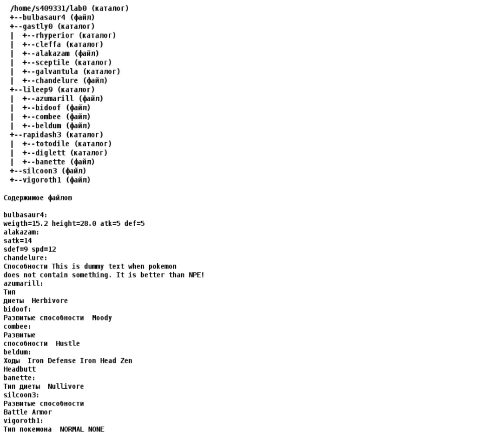

# Лабораторная работа #1
## Вариант 1619

1. Создать приведенное в варианте дерево каталогов и файлов с содержимым. В качестве корня дерева использовать каталог `lab0` своего домашнего каталога. Для создания и навигации по дереву использовать команды: `mkdir`, `echo`, `cat`, `touch`, `ls`, `pwd`, `cd`, `more`, `cp`, `rm`, `rmdir`, `mv`.

   

2. Установить согласно заданию права на файлы и каталоги при помощи команды `chmod`, используя различные способы указания прав.

- `bulbasaur4`: владелец должен читать файл; группа-владелец должна не иметь никаких прав; остальные пользователи должны читать файл
- `gastly0`: владелец должен читать директорию и переходить в нее; группа-владелец должна записывать директорию; остальные пользователи должны читать директорию
- `rhyperior`: -wx--x-w-cleffa: права 307
- `alakazam`: rw----r--
- `sceptile`: владелец должен записывать директорию и переходить в нее; группа-владелец должна читать и записывать директорию; остальные пользователи должны только переходить в директорию
- `galvantula`: владелец должен читать директорию и переходить в нее; группа-владелец должна записывать директорию и переходить в нее; остальные пользователи должны читать, записывать директорию и переходить в нее
- `chandelure`: права 660
- `lileep9`: владелец должен читать, записывать директорию и переходить в нее; группа-владелец должна читать директорию и переходить в нее; остальные пользователи должны записывать директорию и переходить в нее
- `azumarill`: права 046
- `bidoof`: rw--w----
- `combee`: r--r-----
- `beldum`: владелец должен читать и записывать файл; группа-владелец должна не иметь никаких прав; остальные пользователи должны не иметь никаких прав
- `rapidash3`: rwxrwxrwx
- `totodile`: права 550
- `diglett`: права 305
- `banette`: владелец должен не иметь никаких прав; группа-владелец должна читать и записывать файл; остальные пользователи должны записывать файл
- `silcoon3`: права 444
- `vigoroth1`: владелец должен читать и записывать файл; группа-владелец должна читать файл; остальные пользователи должны не иметь никаких прав

3. Скопировать часть дерева и создать ссылки внутри дерева согласно заданию при помощи команд `cp` и `ln`, а также комманды `cat` и перенаправления ввода-вывода.

- cоздать жесткую ссылку для файла `bulbasaur4` с именем `lab0/lileep9/beldumbulbasaur`
- скопировать рекурсивно директорию `lileep9` в директорию `lab0/gastly0/rhyperior`
- объеденить содержимое файлов `lab0/lileep9/beldum`, `lab0/gastly0/alakazam`, в новый файл `lab0/bulbasaur4_43cоздать` 
- создать символическую ссылку для файла `vigoroth1` с именем `lab0/rapidash3/banettevigoroth`
- скопировать содержимое файла `vigoroth1` в новый файл `lab0/gastly0/chandelurevigoroth`
- скопировать файл `vigoroth1` в директорию `lab0/gastly0/galvantula`
- создать символическую ссылку c именем `Copy_45` на директорию `rapidash3` в каталоге `lab0`

4. Используя команды `cat`, `wc`, `ls`, `head`, `tail`, `echo`, `sort`, `grep` выполнить в соответствии с вариантом задания поиск и фильтрацию файлов, каталогов и содержащихся в них данных.

- Подсчитать количество строк содержимого файлов: `alakazam`, `chandelure`, `azumarill`, `bidoof`, `combee`, `beldum`, результат записать в файл в директории `/tmp`, подавить вывод ошибок доступа
- Вывести три первых элемента рекурсивного списка имен и атрибутов файлов в директории `lab0`, заканчивающихся на символ `a`, список отсортировать по убыванию размера, подавить вывод ошибок доступа
- Рекурсивно вывести содержимое файлов из директории `lab0`, имя которых заканчивается на `a`, строки отсортировать по имени a->z, добавить вывод ошибок доступа в стандартный поток вывода
- Подсчитать количество символов содержимого файлов: `azumarill`, `bidoof`, отсортировать вывод по уменьшению количества, ошибки доступа перенаправить в файл в директории `/tmp`
- Вывести два последних элемента рекурсивного списка имен и атрибутов файлов в директории `lab0`, список отсортировать по возрастанию количества жестких ссылок, ошибки доступа не подавлять и не перенаправлять
- Вывести рекурсивно список имен и атрибутов файлов в директории `rapidash3`, список отсортировать по возрастанию даты изменения записи о файле, добавить вывод ошибок доступа в стандартный поток вывода

5. Выполнить удаление файлов и каталогов при помощи команд `rm` и `rmdir` согласно варианту задания.

- Удалить файл `vigoroth1`
- Удалить файл `lab0/gastly0/chandelure`
- удалить символические ссылки `Copy_*`
- удалить жесткие ссылки `lab0/lileep9/beldumbulbasa*`
- Удалить директорию `gastly0`
- Удалить директорию `lab0/rapidash3/diglett`
