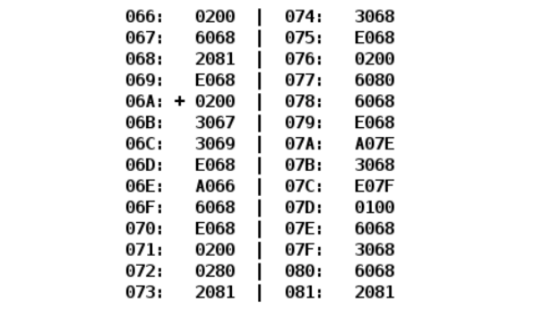

# Лабораторная работа #2

## Вариант `317962`

| .pdf                     | .docx                     |
|--------------------------|---------------------------|
| [report](./opd_lab2.pdf) | [report](./opd_lab2.docx) |

## Задание

По выданному преподавателем варианту определить функцию, вычисляемую программой, область представления и область допустимых значений исходных данных и результата, выполнить трассировку программы, предложить вариант с меньшим числом команд. При выполнении работы представлять результат и все операнды арифметических операций знаковыми числами, а логических операций набором из шестнадцати логических значений.

**Ход работы, содержание отчета и контрольные вопросы описаны в методических указаниях.**
