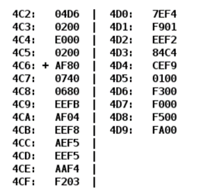

# Лабораторная работа #3

## Вариант `49331`

| .pdf                     | .docx                     |
|--------------------------|---------------------------|
| [report](./opd_lab3.pdf) | [report](./opd_lab3.docx) |

## Задание

По выданному преподавателем варианту восстановить текст заданного варианта программы, определить предназначение и составить описание программы, определить область представления и область допустимых значений исходных данных и результата, выполнить трассировку программы.

**Ход работы, содержание отчета и контрольные вопросы описаны в методических указаниях.**
