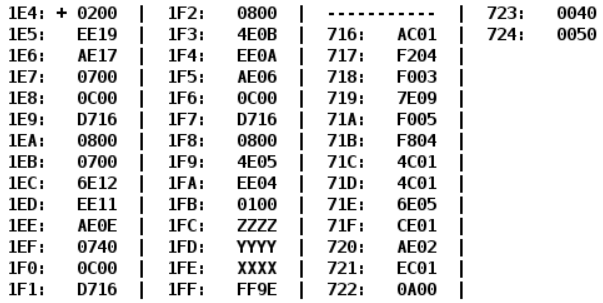

# Лабораторная работа 4

## Вариант `14289`

| .pdf                     | .docx                     |
|--------------------------|---------------------------|
| [report](./opd_lab4.pdf) | [report](./opd_lab4.docx) |

## Задание

По выданному преподавателем варианту восстановить текст заданного варианта программы и подпрограммы (программного комплекса), определить предназначение и составить его описание, определить область представления и область допустимых значений исходных данных и результата, выполнить трассировку программного комплекса.

**Ход работы, содержание отчета и контрольные вопросы описаны в методических указаниях.**
